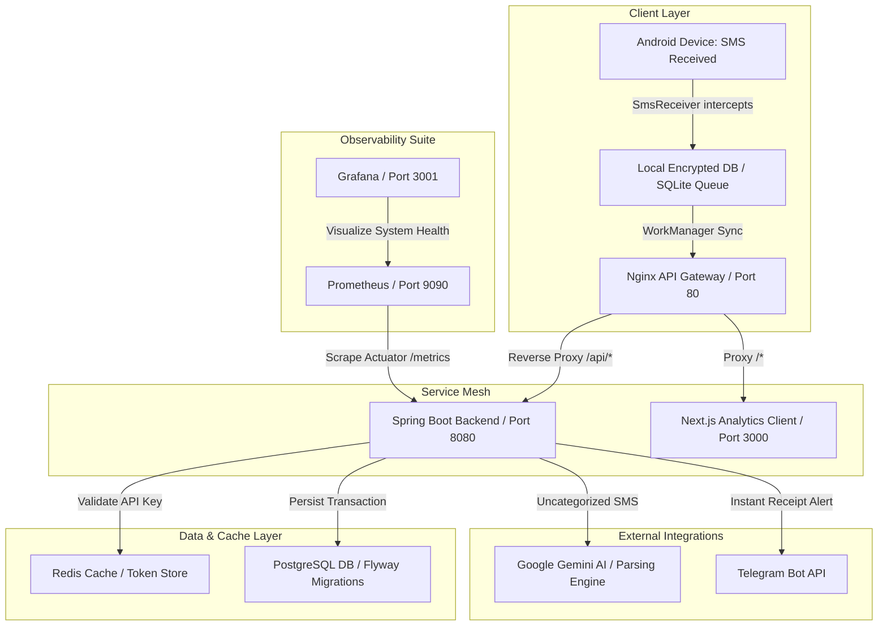

# FinTrack AI — Production-Grade Real-Time UPI Tracking & Finance Intelligence

FinTrack AI is a SaaS-quality, end-to-end automated personal finance monitoring platform. It intercepts banking SMS transaction alerts on a user's Android phone, routes them securely via webhook, parses them in real time using Spring Boot and Gemini AI, updates a Next.js 15 dashboard, and pushes instant notifications to Telegram.

---

## 🏗️ Platform Architecture

The platform utilizes a modern, distributed architecture for high reliability, offline persistence, and observability.



---

## 📁 Repository Structure

```text
fintrack-ai/
├── android/            # Native Android SMS Collector client app
│   ├── app/            # Android app source code (Kotlin)
│   └── README.md       # Android client setup & configuration instructions
├── backend/            # Spring Boot 3 Java backend REST API engine
│   ├── src/            # Java backend components (Controllers, Services, Repositories, Entities)
│   ├── Dockerfile      # Backend containerization file
│   └── pom.xml         # Maven dependencies
├── db/                 # Database schema migrations
│   └── migration/      # Flyway SQL migration script files
├── devops/             # Orchestration & local service configurations
│   ├── nginx/          # Reverse proxy routing parameters
│   ├── prometheus/     # Metric scraping configurations
│   └── docker-compose.yml # Main compose topology configuration
├── frontend/           # Next.js 15 Tailwind UI dashboard
│   ├── src/            # React/Next.js dashboard page views & components
│   ├── Dockerfile      # Frontend containerization file
│   └── package.json    # Frontend dependency tree
└── README.md           # Main platform documentation (This file)
```

---

## ⚡ Core Component Specifications

### 1. Spring Boot 3 Core Backend API
- **Technology stack**: Java 17, Spring Boot 3, Spring Security (JWT / API Key authorization), Hibernate JPA, Spring Actuator.
- **Webhook Engine**: Receives payload posts from the Android client. Authorizes uploads via client-generated secure SHA-256 API Key hashes.
- **Intelligent Parser**: Uses a regex parser fallback system combined with **Google Gemini Pro Flash** API integration to parse complex banking notifications into structured database models.
- **Telegram Bot Integration**: Generates and pushes rich expense notification receipts directly to the user's private Telegram chat or channel.

### 2. Next.js 15 Dashboard
- **Technology stack**: React 19, Next.js 15, Tailwind CSS, Lucide Icons, Recharts.
- **Overview Dashboard**: Displays real-time estimates of account balances, monthly budgets, and interactive trend lines showing running ledger balances.
- **Interactive Webhook Simulator**: Built-in visual SMS webhook simulator, letting developers test the ingress pipeline directly from the UI without an emulator.
- **Gateway Manager**: UI manager for registering, hashing, and revoking API keys for Android devices.

### 3. Android SMS Collector Client
- **Technology stack**: Native Kotlin, Android SDK, WorkManager, SQLCipher, BroadcastReceiver.
- **Reliable SMS Interceptor**: BroadcastReceiver hooks into `RECEIVE_SMS` system broadcasts, filtering sender IDs (e.g., `HDFCBank`, `SBI`) to isolate transactions.
- **Offline Resilience**: Saves transactions locally in SQLCipher (encrypted database). Automatically pushes backlog transaction queues when network states are validated by WorkManager.
- **Power Management**: Requests battery optimization exemptions to bypass OS-level Doze cycles, guaranteeing 24/7 background availability.

### 4. Database Schema
Managed via **Flyway Migrations** on a **PostgreSQL 16** database.
- `users`: Core profile configuration & credentials.
- `user_settings`: User dashboard settings, monthly budgets, currencies, and Telegram channel configs.
- `transactions`: Detailed ledger records including merchant, category, amount, bank, reference codes, and balances.
- `api_keys`: Access tokens hashes for device validation.
- `sms_logs`: Logs raw intercepted SMS text, parsing performance, and parser confidence indicators.

---

## 🚀 Getting Started

### Prerequisites
- [Docker](https://www.docker.com/) & [Docker Compose](https://docs.docker.com/compose/)
- Google Gemini API Key
- Telegram Bot Token & Chat ID (Optional but recommended)

### Quick Start Deployment

1. **Clone the Repository**:
   ```bash
   git clone <repository_url> fintrack-ai
   cd fintrack-ai
   ```

2. **Configure Environment Variables**:
   Create a `.env` file inside the `devops/` directory with the following variables:
   ```env
   DATABASE_PASSWORD=your_postgres_password
   JWT_SECRET=your_32_character_jwt_secret
   TELEGRAM_BOT_TOKEN=your_telegram_bot_token
   TELEGRAM_CHAT_ID=your_telegram_channel_or_chat_id
   GEMINI_API_KEY=your_google_gemini_api_key
   ```

3. **Spin up the Services**:
   In the `devops/` directory, launch the entire container swarm:
   ```bash
   cd devops
   docker-compose up --build -d
   ```
   This will build and start:
   - PostgreSQL (port `5432`)
   - Redis Cache (port `6379`)
   - Spring Boot Core App (port `8080`)
   - Next.js 15 Dashboard App (port `3000`)
   - Nginx Reverse Proxy (port `80`)
   - Prometheus Metric Scraper (port `9090`)
   - Grafana Visualization Engine (port `3001` - default credentials: `admin`/`admin`)

4. **Verify Application Ingress**:
   - Access the Next.js Web Dashboard: `http://localhost`
   - Access Core API Swagger Docs (if enabled): `http://localhost/api/swagger-ui.html`
   - Access Grafana Metrics: `http://localhost:3001`

---

## 📡 Webhook Payload Format

The Android client submits parsed or raw payloads via HTTP POST. 

**Endpoint**: `POST http://localhost/api/webhook/sms`  
**Headers**:
- `X-API-KEY`: `<your-generated-api-key>`
- `Content-Type`: `application/json`

**Body**:
```json
{
  "sender": "HDFCBank",
  "text": "Alert: You've made a txn of Rs. 350.00 at Swiggy on 10-06-2026 21:00:00 using HDFC Bank Card. Avl Bal: Rs.24217.32. Ref: UPI7483012",
  "timestamp": 1781107800000
}
```

---

## 🔒 Security Best Practices
- **TLS/SSL Encryption**: All inbound device transactions should be served over HTTPS.
- **HMAC/Token Hashing**: Device API keys are never stored in plain text. They are hashed using SHA-256 upon generation, ensuring that even in case of database leakage, client connections cannot be compromised.
- **AES-256 Storage**: The Android app secures the local transaction queue using SQLCipher, protecting device records if the phone is physically lost or compromised.
