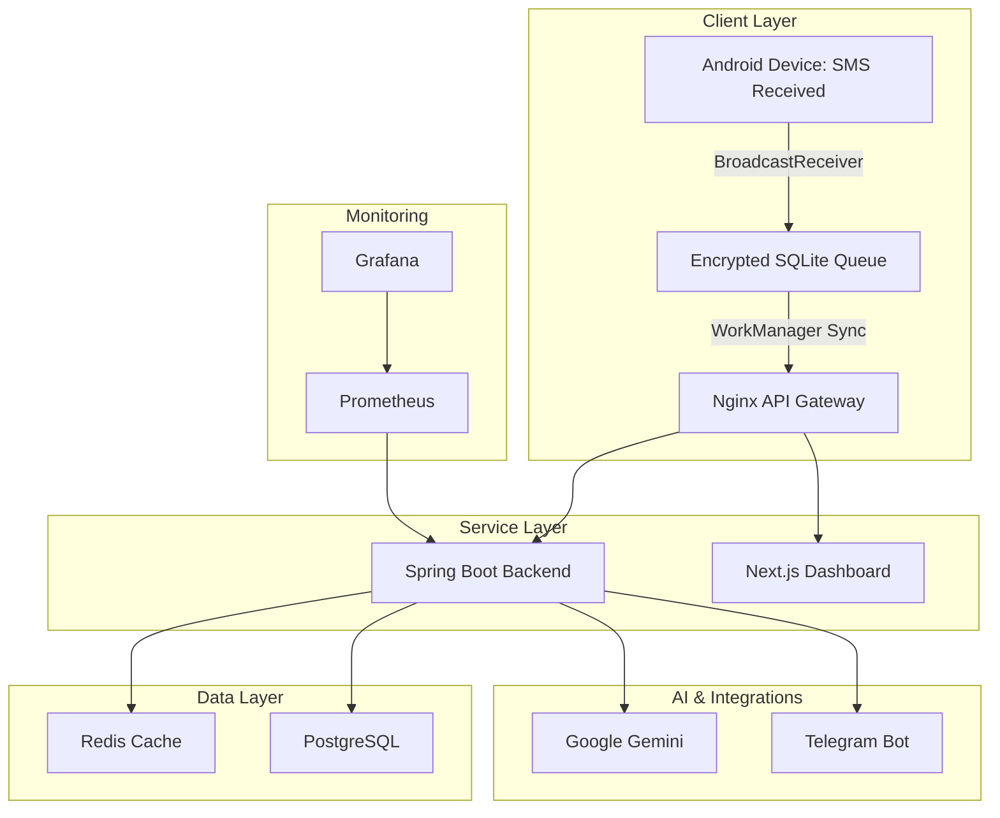

# FinTrack AI
### Production-Grade Real-Time UPI Tracking, Expense Intelligence & Personal Finance Analytics Platform


---

# Overview

FinTrack AI is a production-ready personal finance intelligence platform that automatically captures banking transaction SMS alerts from Android devices and converts them into structured financial records.

Unlike traditional expense trackers that require manual entry, FinTrack AI creates a fully automated financial monitoring pipeline by:

- Detecting incoming banking SMS alerts
- Extracting transaction details
- Categorizing expenses using AI
- Updating dashboards in real time
- Sending Telegram notifications
- Maintaining a complete financial ledger

The platform is designed around reliability, security, observability, scalability, and offline-first principles.

---

# Why FinTrack AI?

Managing personal finances often requires manually recording expenses or exporting bank statements. FinTrack AI eliminates this friction by automatically tracking transactions the moment they occur.

## Key Benefits

- Zero manual expense entry
- Real-time transaction monitoring
- AI-powered categorization
- Multi-bank compatibility
- Offline transaction persistence
- Live analytics dashboard
- Instant Telegram notifications
- Production-grade monitoring stack

---

# Platform Architecture



---

# System Workflow

```text
Incoming Banking SMS
          │
          ▼
Android SMS Receiver
          │
          ▼
Encrypted Local Queue
          │
          ▼
Background Sync Service
          │
          ▼
Spring Boot Webhook
          │
          ▼
Transaction Parser
      ┌───────────┐
      │           │
      ▼           ▼
Regex Parser  Gemini AI
      │           │
      └─────┬─────┘
            ▼
      PostgreSQL
            │
     ┌──────┴──────┐
     ▼             ▼
Telegram      Dashboard
Notifications  Analytics
```

---

# Core Features

## Automated Expense Tracking

The Android client continuously monitors incoming banking SMS notifications and automatically extracts financial information.

Supported transactions:

- UPI Payments
- Card Payments
- ATM Withdrawals
- Salary Credits
- Refunds
- IMPS Transfers
- NEFT Transfers
- RTGS Transfers
- EMI Deductions
- Interest Credits

No manual intervention required.

---

## AI-Powered SMS Understanding

Different banks send notifications in different formats.

FinTrack AI uses a hybrid parsing engine.

### Layer 1: Regex Parser

Extracts:

- Amount
- Merchant
- Bank
- Transaction Type
- Balance
- Reference Number

### Layer 2: Gemini AI

For messages with low parsing confidence:

Input:

```text
Rs 239 paid to Zomato via UPI from SBI A/C XX2345
```

Output:

```json
{
  "amount": 239,
  "merchant": "Zomato",
  "category": "Food",
  "bank": "SBI",
  "paymentMethod": "UPI"
}
```

---

## Real-Time Analytics Dashboard

Built with Next.js 15 and React 19.

Dashboard includes:

- Monthly Expenses
- Daily Spending Trends
- Category Breakdown
- Budget Utilization
- Bank Distribution
- Cash Flow Analytics
- Expense Heatmaps
- Balance Tracking
- Recent Transactions

---

## Telegram Receipt Notifications

Every processed transaction can generate an instant Telegram notification.

Example:

```text
💸 Expense Recorded

Merchant: Swiggy
Amount: ₹350
Category: Food
Bank: HDFC

Available Balance:
₹24,217

Reference:
UPI7483012
```

---

# Repository Structure

```text
fintrack-ai/
├── android/
│   ├── app/
│   └── README.md
│
├── backend/
│   ├── src/
│   ├── Dockerfile
│   └── pom.xml
│
├── db/
│   └── migration/
│
├── devops/
│   ├── nginx/
│   ├── prometheus/
│   └── docker-compose.yml
│
├── frontend/
│   ├── src/
│   ├── Dockerfile
│   └── package.json
│
└── README.md
```

---

# Technology Stack

## Backend

| Technology | Purpose |
|------------|----------|
| Java 17 | Runtime |
| Spring Boot 3 | Backend API |
| Spring Security | Authentication |
| Hibernate JPA | ORM |
| Flyway | Database Migration |
| PostgreSQL 16 | Database |
| Redis | Cache |
| Spring Actuator | Metrics |

---

## Frontend

| Technology | Purpose |
|------------|----------|
| Next.js 15 | Frontend Framework |
| React 19 | UI Library |
| Tailwind CSS | Styling |
| Recharts | Analytics |
| Lucide Icons | Icons |

---

## Android

| Technology | Purpose |
|------------|----------|
| Kotlin | Native Android |
| BroadcastReceiver | SMS Capture |
| WorkManager | Background Sync |
| SQLCipher | Encrypted Storage |

---

## DevOps

| Technology | Purpose |
|------------|----------|
| Docker | Containerization |
| Docker Compose | Orchestration |
| Nginx | Reverse Proxy |
| Prometheus | Metrics |
| Grafana | Visualization |

---

# Database Schema

## users

Stores account information.

```sql
users
```

Fields:

```text
id
name
email
password_hash
created_at
updated_at
```

---

## transactions

Stores financial records.

```sql
transactions
```

Fields:

```text
id
user_id
amount
merchant
category
bank
transaction_type
reference_number
available_balance
timestamp
created_at
```

---

## api_keys

Stores hashed device authentication keys.

```sql
api_keys
```

Fields:

```text
id
user_id
key_hash
device_name
created_at
last_used
```

---

## sms_logs

Stores parser diagnostics.

```sql
sms_logs
```

Fields:

```text
id
raw_sms
parser_used
confidence
processing_time
created_at
```

---

# API Documentation

## Submit SMS

### Request

```http
POST /api/webhook/sms
```

Headers:

```http
X-API-KEY: your_api_key
Content-Type: application/json
```

Body:

```json
{
  "sender": "HDFCBank",
  "text": "Alert: You've made a txn of Rs. 350.00 at Swiggy.",
  "timestamp": 1781107800000
}
```

Response:

```json
{
  "success": true,
  "transactionId": 123,
  "parsed": true
}
```

---

## Get Transactions

```http
GET /api/transactions
```

Response:

```json
[
  {
    "merchant": "Swiggy",
    "amount": 350,
    "category": "Food"
  }
]
```

---

## Analytics Summary

```http
GET /api/analytics/summary
```

Response:

```json
{
  "monthlyExpense": 12450,
  "foodExpense": 4200,
  "transportExpense": 1800
}
```

---

# Security Architecture

## Device Authentication

Each Android device receives a unique API key.

Workflow:

```text
Generate API Key
        │
        ▼
SHA-256 Hash
        │
        ▼
Store Hash Only
```

Raw keys are never stored.

---

## Encryption

### Android Storage

```text
AES-256 SQLCipher Encryption
```

### Network

```text
HTTPS
TLS 1.3
```

---

## Rate Limiting

Redis-based throttling.

Example:

```text
100 Requests / Minute / Device
```

---

# Observability

## Spring Actuator Metrics

Collected metrics include:

- JVM Memory
- CPU Usage
- API Latency
- Request Count
- Error Rates
- Database Health
- Redis Health

---

## Prometheus

Metrics endpoint:

```http
/actuator/prometheus
```

---

## Grafana Dashboards

Visualizations:

- Request Throughput
- Transaction Volume
- API Response Times
- JVM Health
- Database Metrics
- Cache Performance

---

# Quick Start

## Clone Repository

```bash
git clone https://github.com/yourusername/fintrack-ai.git
cd fintrack-ai
```

---

## Environment Variables

Create:

```bash
devops/.env
```

```env
DATABASE_PASSWORD=postgres_password
JWT_SECRET=your_jwt_secret
TELEGRAM_BOT_TOKEN=telegram_bot_token
TELEGRAM_CHAT_ID=telegram_chat_id
GEMINI_API_KEY=gemini_api_key
```

---

## Start Platform

```bash
cd devops
docker-compose up --build -d
```

---

## Available Services

| Service | URL |
|----------|------|
| Dashboard | http://localhost |
| Backend API | http://localhost/api |
| Swagger Docs | http://localhost/api/swagger-ui.html |
| Grafana | http://localhost:3001 |
| Prometheus | http://localhost:9090 |

---

# Performance Targets

| Metric | Target |
|----------|----------|
| API Latency | <150ms |
| SMS Processing | <500ms |
| Notification Delivery | <5s |
| Dashboard Load | <2s |
| Availability | 99.9% |
| Parser Accuracy | >95% |

---

# Roadmap

## Version 2.0

- AI Budget Recommendations
- Subscription Detection
- Recurring Expense Prediction
- Monthly Financial Reports
- Multi-Bank Support
- Smart Spending Insights

## Version 3.0

- Investment Tracking
- Credit Score Monitoring
- Tax Planning Assistant
- OCR Receipt Scanner
- Voice Assistant Integration

---

# Skills Demonstrated

This project showcases expertise in:

- Full Stack Development
- Spring Boot Architecture
- Next.js 15 Development
- Android Native Development
- PostgreSQL Database Design
- Redis Caching
- Docker & DevOps
- Reverse Proxy Configuration
- API Security
- AI Integration
- Real-Time Data Pipelines
- Monitoring & Observability
- SaaS Product Engineering

---

## License

MIT License

---

### FinTrack AI transforms raw banking SMS messages into actionable financial intelligence through a secure, scalable, AI-powered platform designed for modern personal finance management.

⭐ If you find this project useful, consider giving it a star.