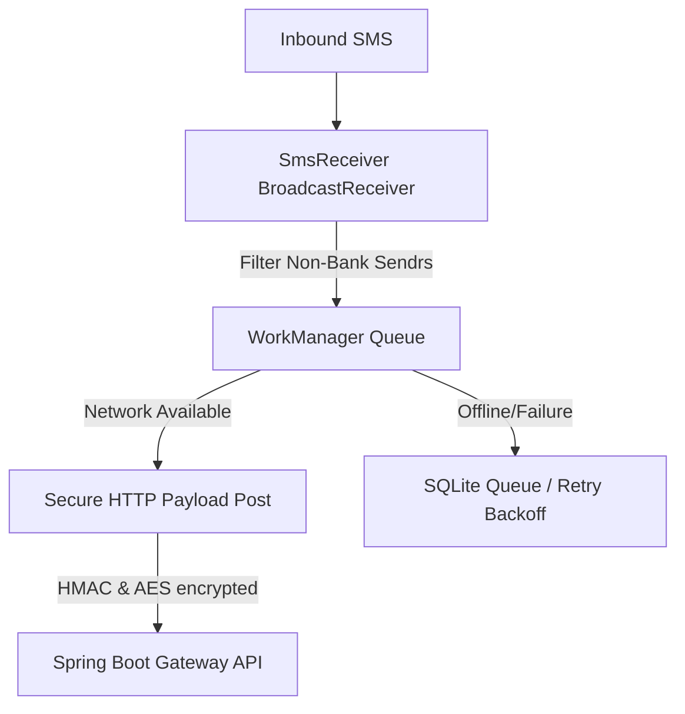

# FinTrack AI — Android SMS Collector Client

A lightweight, secure native Android background utility that intercepts incoming UPI banking notifications and relays them via a secure API Webhook to the central FinTrack AI platform.

---

## Technical Overview


## System Requirements & Permissions
The application runs in the background as a foreground service to guarantee high uptime under strict Android DOZE battery constraints.

1. **Manifest Permissions Required**:
   ```xml
   <uses-permission android:name="android.permission.RECEIVE_SMS" />
   <uses-permission android:name="android.permission.READ_SMS" />
   <uses-permission android:name="android.permission.INTERNET" />
   <uses-permission android:name="android.permission.FOREGROUND_SERVICE" />
   <uses-permission android:name="android.permission.REQUEST_IGNORE_BATTERY_OPTIMIZATIONS" />
   ```

2. **Battery Optimization Exemption**:
   To prevent the Android OS from stopping the app during deep idle states, users must toggle off battery optimizations:
   ```kotlin
   val intent = Intent(Settings.ACTION_REQUEST_IGNORE_BATTERY_OPTIMIZATIONS).apply {
       data = Uri.parse("package:${packageName}")
   }
   startActivity(intent)
   ```

3. **Offline Queue Resilience**:
   All intercepted SMS text payloads are stored in a local SQLite database (encrypted with AES-256 via SQLCipher/Jetpack Security). If the device is offline or the webhook API fails, Jetpack `WorkManager` queues the job and runs it with an exponential backoff retry policy when connectivity is restored.
