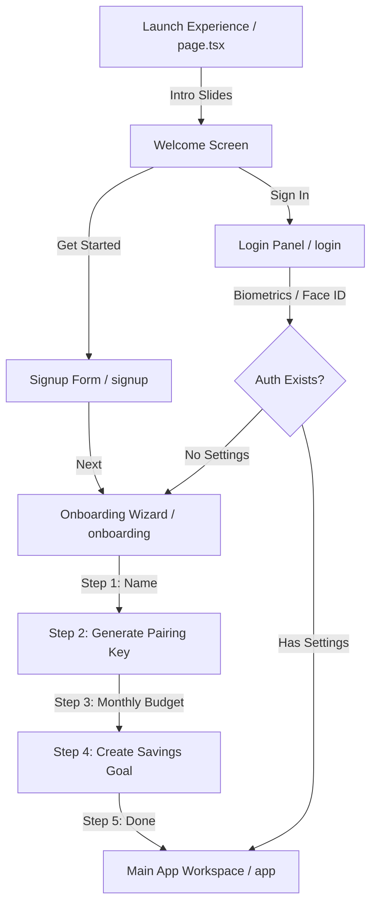

# FinTrack AI — Complete Frontend Architecture & Specification

This document provides a comprehensive technical overview and code walkthrough of the **FinTrack AI Web Dashboard & Native Mobile Frontend**. 

The frontend is built on a modern **Next.js 15 App Router** architecture integrated with **Capacitor 8** hybrid mobile wrappers. It features a bespoke, premium design system designed for personal finance tracking, native biometrics integration, and developer telemetry tooling.

---

## 🏗️ Technical Architecture & Stack

The frontend runs a hybrid web/native architecture targeting web browsers as well as iOS and Android devices through native runtime mappings.

### Core Frameworks
* **React 19 & Next.js 15 (App Router)**: Utilizing React Server/Client Component isolation. All routing, view state management, and page transitions are handled client-side (`"use client"`) to support offline-first Capacitor execution.
* **Capacitor 8**: Wraps the compiled Next.js static output (`out/`) inside a native WebView container for Android and iOS, mapping web APIs to native OS SDK bindings.
* **TypeScript**: Fully typed schema models for Transactions, Budgets, Saving Goals, API credentials, and Webhook Payloads.

### Auxiliary Libraries
* **Lucide Icons**: Consistent, modern financial and system glyphs.
* **Recharts**: Lightweight SVG charts used to display weekly cash flows and category budget analytics.
* **Capgo Native Biometric (`@capgo/capacitor-native-biometric`)**: Interfaces directly with Android BiometricPrompt and iOS LocalAuthentication (Face ID / Touch ID).
* **Capacitor Core Plugins**: Handles device telemetry (Haptics, Keyboards, Status Bar configurations, and Push Notification registry).

---

## 🎨 Design System & Theming

The user interface follows a warm, high-contrast palette. All cyberpunk glowing elements, neon text, and hacker-themed components have been replaced with solid cards, refined borders, and human-centric feedback states.

### Palette Tokens
Defined inside [globals.css](file:///C:/Users/acer/.gemini/antigravity-ide/scratch/fintrack-ai/frontend/src/app/globals.css):
* **Canvas Background**: Deep Charcoal (`#111827` / HSL values for dark mode toggle)
* **Containers & Cards**: Warm Navy / Slate (`#1F2937`)
* **Primary Text**: Warm Off-White (`#FCFBF8`)
* **Muted Text / Labels**: Soft Beige (`#F8F5F1`) & Muted Sage (`#A8B5A2`)
* **Accents & Highlights**: Premium Gold (`#C9A76A`)
* **Status Colors**:
  * *Success / Target Reached*: Safe Sage (`#4F7A5B`)
  * *Warning / Limit Approaching*: Amber Gold (`#C9964B`)
  * *Alert / Exceeded Limit*: Terracotta (`#B85C4D`)

### Layout Constraints
* **Grid**: Strict **12-column layouts** for desktop viewports, downscaling to single-column card flows on mobile devices.
* **Glassmorphism Reductions**: Borders use solid thin divider styling (`rgba(252, 251, 248, 0.08)`) and high-end drop shadows (`shadow-sm`) for structural elevation instead of neon glow offsets.
* **Animations**: Pure CSS micro-interactions, scale-in, slide-up, and fade-in keyframes used to create immediate response loops for UI interactions.

---

## 📂 Source Code Map

All key project files are organized as follows:

* [package.json](file:///C:/Users/acer/.gemini/antigravity-ide/scratch/fintrack-ai/frontend/package.json) — Registers dependencies, Capacitor plug-ins, and build configurations.
* [capacitor.config.ts](file:///C:/Users/acer/.gemini/antigravity-ide/scratch/fintrack-ai/frontend/capacitor.config.ts) — Configures native Android/iOS bundling targets, WebView behaviors, and Android build settings.
* [tailwind.config.js](file:///C:/Users/acer/.gemini/antigravity-ide/scratch/fintrack-ai/frontend/tailwind.config.js) — Declares color palette mapping and typography sizes.
* [src/app/globals.css](file:///C:/Users/acer/.gemini/antigravity-ide/scratch/fintrack-ai/frontend/src/app/globals.css) — Custom global CSS tokens, component utility definitions (`.fin-card`, `.fin-input`, `.badge-gold`), dark mode overrides, and system keyframe animations.
* [src/app/layout.tsx](file:///C:/Users/acer/.gemini/antigravity-ide/scratch/fintrack-ai/frontend/src/app/layout.tsx) — Main layout wrapper supplying site metadata and viewport setups.

### Pages & View Routing
* [src/app/page.tsx](file:///C:/Users/acer/.gemini/antigravity-ide/scratch/fintrack-ai/frontend/src/app/page.tsx) — Interactive Mobile Launch landing page with custom intro slide presentation.
* [src/app/login/page.tsx](file:///C:/Users/acer/.gemini/antigravity-ide/scratch/fintrack-ai/frontend/src/app/login/page.tsx) — Log-in panel with email/password logic, social single sign-on simulations, and Capacitor biometrics handler.
* [src/app/signup/page.tsx](file:///C:/Users/acer/.gemini/antigravity-ide/scratch/fintrack-ai/frontend/src/app/signup/page.tsx) — Register UI workspace page.
* [src/app/forgot-password/page.tsx](file:///C:/Users/acer/.gemini/antigravity-ide/scratch/fintrack-ai/frontend/src/app/forgot-password/page.tsx) — Forgot password recovery form.
* [src/app/onboarding/page.tsx](file:///C:/Users/acer/.gemini/antigravity-ide/scratch/fintrack-ai/frontend/src/app/onboarding/page.tsx) — Step-by-step setup onboarding wizard (Name input, Device pairing token, Budget target limits, Savings targets).
* [src/app/verify/page.tsx](file:///C:/Users/acer/.gemini/antigravity-ide/scratch/fintrack-ai/frontend/src/app/verify/page.tsx) — Device connection / multi-factor verification check.
* [src/app/success/page.tsx](file:///C:/Users/acer/.gemini/antigravity-ide/scratch/fintrack-ai/frontend/src/app/success/page.tsx) — Setup confirmation success landing screen.
* [src/app/app/page.tsx](file:///C:/Users/acer/.gemini/antigravity-ide/scratch/fintrack-ai/frontend/src/app/app/page.tsx) — **The Core Workspace Dashboard**. Houses the entire authenticated multi-tab experience.

---

## 📱 User Onboarding & Gates

The platform provides a secure, friction-free gateway onboarding checklist before letting the client access the ledger.



### 1. Interactive Presentation Screen
Defined in [page.tsx](file:///C:/Users/acer/.gemini/antigravity-ide/scratch/fintrack-ai/frontend/src/app/page.tsx), it serves as a dynamic, slide-based introduction detailing:
* Real-time automated bank SMS intercepts (with animations showing raw text translation to structured transaction ledger cards).
* The AI Copilot Financial Coach chat preview.
* Goals and budgets tracking bars with visual progress percentages.

### 2. Login & Native Biometric authentication
Located in [login/page.tsx](file:///C:/Users/acer/.gemini/antigravity-ide/scratch/fintrack-ai/frontend/src/app/login/page.tsx):
* In standard browsers: Runs a high-fidelity visual biometric simulator overlay demonstrating a Face ID scanner status checking state.
* On native mobile platforms: Validates physical hardware presence via `NativeBiometric.isAvailable()`. If supported, prompts the native OS Face ID or fingerprint biometric UI. Upon verification, sets authentication credentials locally and grants access to `/app`.

### 3. Setup Onboarding Wizard
In [onboarding/page.tsx](file:///C:/Users/acer/.gemini/antigravity-ide/scratch/fintrack-ai/frontend/src/app/onboarding/page.tsx):
1. **User Profile**: Welcomes the user and records their display name.
2. **Device Pairing**: Auto-generates a secure device-linking token (`ft_pair_...`) matching the backend client expectations.
3. **Monthly Budgeting**: Standard range slide input to specify absolute expenditure ceilings.
4. **Target Allocation**: Initializes the user's primary savings goal by mapping description strings, targets, and emojis.
5. **Success Route**: Completes synchronization and transfers configurations into `localStorage` before routing to `/app`.

---

## 🎛️ Primary Workspace Dashboard

The core dashboard inside [app/page.tsx](file:///C:/Users/acer/.gemini/antigravity-ide/scratch/fintrack-ai/frontend/src/app/app/page.tsx) handles all transaction views, AI interactions, and dev telemetry features. It shifts layout dynamically based on target viewport boundaries.

```text
Dashboard Layout Structure
┌────────────────────────────────────────────────────────┐
│  Desktop Mode (Sidebar Layout)                         │
│  ┌───────────┐┌──────────────────────────────────────┐ │
│  │ Navigation││  Main View Canvas                    │ │
│  │           ││  [Home / Activity / Coach / Goals]  │ │
│  │           │├──────────────────────────────────────┤ │
│  │           ││  Developer Tools / Diagnostic Logs   │ │
│  │           ││  [Webhook Simulator / Key Manager]   │ │
│  └───────────┘└──────────────────────────────────────┘ │
└────────────────────────────────────────────────────────┘
┌────────────────────────────────────────────────────────┐
│  Mobile Mode (Bottom Tab Navigation)                  │
│  ┌──────────────────────────────────────────────────┐ │
│  │                  Active Tab Canvas               │ │
│  └──────────────────────────────────────────────────┘ │
│  ┌──────────────────────────────────────────────────┐ │
│  │ [Home]   [Activity]   [Copilot]  [Goals]  [Dev]  │ │
│  │ (Floating Bottom Pill Navigation)                │ │
│  └──────────────────────────────────────────────────┘ │
└────────────────────────────────────────────────────────┘
```

### Dashboard View Tabs

#### 🏠 Home View
* **Financial Health Index**: Radial SVG target ring component illustrating safety health metrics (e.g. `86/100`).
* **AI Summary Panel**: Dynamic contextual brief analyzing overall cash flows (e.g. *"You spent ₹420 less than usual today"*).
* **Category Budget Overview**: Carousels displaying remaining budget limits on categories (Food, Shopping, Travel, Entertainment) colored dynamically based on threshold safety status (Sage, Amber, or Terracotta).
* **Recent Activity & Subscriptions**: Previews the latest transactions and upcoming monthly recurring liabilities.

#### 📈 Activity View
* **Transaction Ledger**: Scrollable history grouped by date headers. Includes expandable detail panes with action buttons for custom tagging, attachments, and flags.
* **Search & Filters**: Quick-filtering text bar targeting merchants and category schemas. Toggles filters between *Income*, *Expenses*, *Transfers*, and *Subscriptions*.

#### 🤖 AI Copilot View
* **Chat Console**: Multi-turn dialogue box mapping interactive AI insights.
* **Quick Prompts**: Context buttons triggering popular queries (e.g. *"Can I afford a MacBook this month?"*).
* **Rich Data Previews**: Inline tables and trend widgets generated as response extensions inside the message bubble flow.

#### 🎯 Savings Goals View
* **Target Grid**: Progress rings mapping accumulated amounts against total goal targets.
* **Intelligent Tips**: Tailored advice highlighting necessary monthly savings parameters to meet selected dates.

#### ⚙️ Profile & Developer console
* **Biometrics Toggle**: Stores permission states to bypass login prompts on startup.
* **SMS Gateway Health**: Visual monitoring metrics mapping pipeline telemetry.
* **Hashed API Key Manager**: Allows live generation of API secret keys (`ft_live_...`). Displays key details alongside revoking utility calls that trigger backend database removal.
* **Webhook Simulator**: Integrated webhook debugger allowing developers to formulate mock SMS transaction strings, trigger incoming webhook posts, parse values, and monitor pipeline performance logs directly inside the browser.

---

## 📡 Live Integration & Sync Logic

The frontend utilizes a robust API integration service that syncs simulated state models with real endpoints when connected.

### Local State Fallbacks
If the core Spring Boot backend is offline or unreachable, the application falls back gracefully:
1. **Mock Data Engine**: Seamlessly falls back to local data tables for all views, enabling interactive demonstrations of all features.
2. **Interactive Simulators**: Runs regex-based transaction parsing locally to populate transaction arrays, updates mock balance estimates, and modifies chart inputs in real time.

### Real Backend Synced Endpoints
When backend configurations are active, client actions target:
* `POST /api/v1/auth/login`: Validates user profile credentials, returning JWT access tokens.
* `GET /api/v1/settings`: Pulls core limits, budgets, and user details.
* `GET /api/v1/transactions`: Synchronizes paginated ledger entries.
* `POST /api/v1/settings/api-keys`: Registers encrypted SHA-256 tokens for native device synchronization.
* `DELETE /api/v1/settings/api-keys/{id}`: Revokes active access credentials.

---

## 🛠️ Verification & Verification Commands

To verify and run the frontend application:

### Run Development Server
```bash
cd frontend
npm install
npm run dev
```
Open `http://localhost:3000` to inspect the web client.

### Run Production Static Export
```bash
npm run build
```
This builds and exports static assets into `out/` ready to be bridged by Capacitor.

### Synchronize Capacitor Android Wrapper
```bash
npx cap sync
npx cap open android
```
This copies static artifacts into the Android studio project located under `frontend/android/` for native app compiling.
